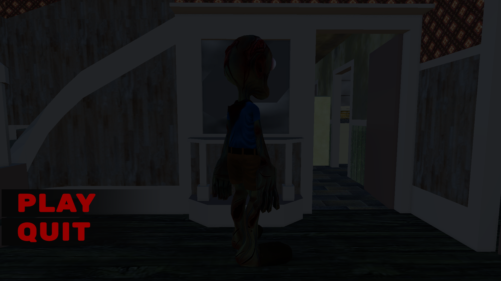
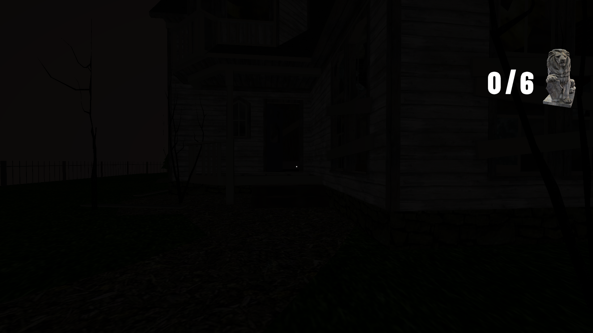
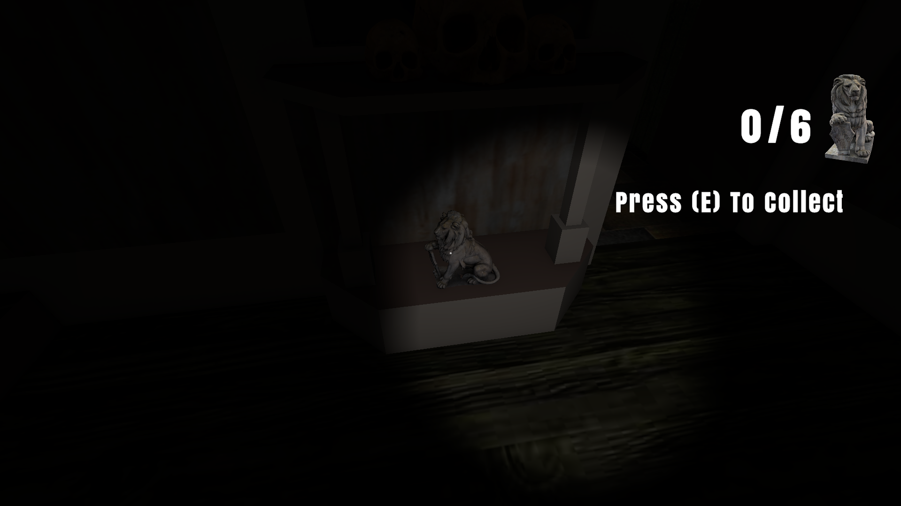
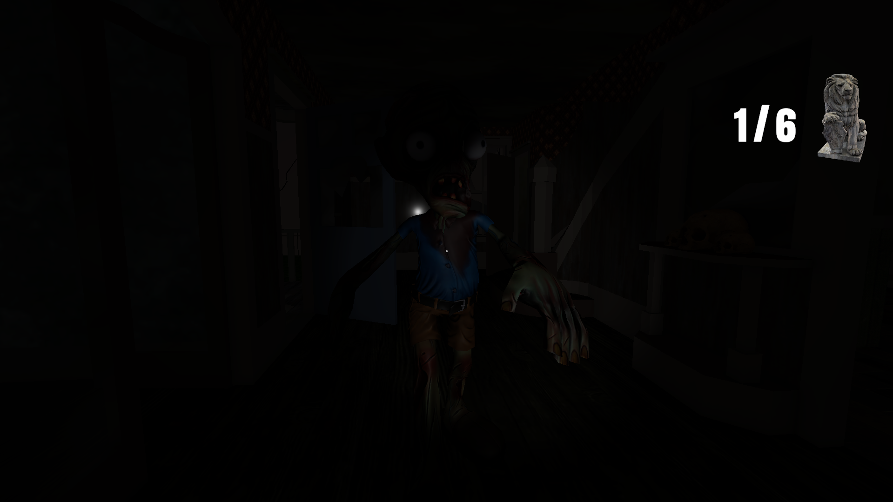
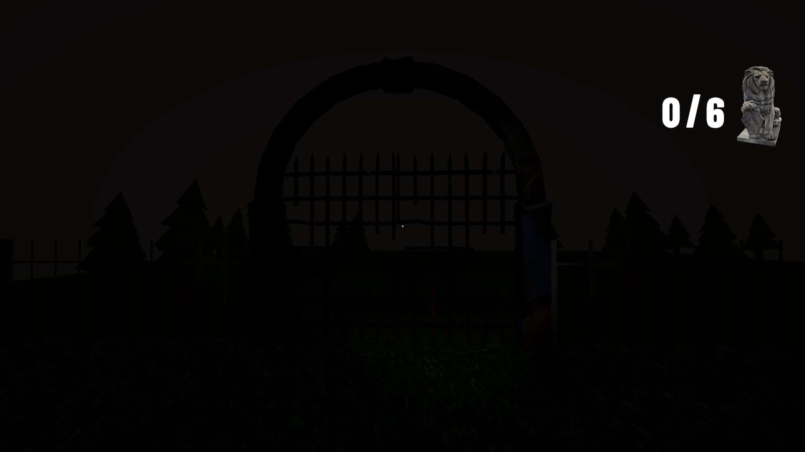

# 3D Horror Survival Game

A first-person 3D horror survival game developed in Unity using C#. The player must explore a dark environment, collect 6 hidden statues, unlock the exit gate, and escape while avoiding a dangerous enemy that patrols, chases, and attacks the player.

## ✨ Features

* Main Menu System
* First-Person Player Controller
* Dark Horror Environment
* Collectible Statue Objective System
* UI Counter for Collected Statues
* Enemy AI with Patrol and Chase Behavior
* Gate Unlock Progression System
* Sound Effects and Audio Feedback
* Game Over and Game Complete Screens

## 🎮 Gameplay

The player starts outside a house in a dark environment. The objective is to collect all 6 hidden statues while surviving the enemy roaming around the area. Each collected statue updates the UI counter. After collecting all statues, the exit gate opens with an audio message, allowing the player to escape and complete the game.

## 🕹️ Controls

* WASD — Move
* Mouse — Look Around

## 📸 Screenshots

### 🏠 Main Menu

### 🌑 Gameplay

### 🗿 Statue Collection

### 👹 Enemy Chase

### 🚪 Gate Opened

## 🛠️ Built With

* Unity
* C#

## 📚 Project Purpose

This project was created as part of my game development portfolio to improve my Unity and C# skills by building a complete playable horror game with gameplay systems, UI, audio, enemy AI, and progression mechanics.
